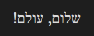
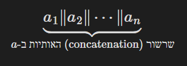

# Obsidian RTL Math Text Plugin

**RTL Math Text** is an [Obsidian](https://obsidian.md) plugin that adds basic support for mixing right-to-left (RTL) and left-to-right (LTR) text in MathJax math expressions through the use of custom LaTeX commands.

---

## Features

- Add strictly **right-to-left (RTL)** text (e.g. Hebrew) inside math expressions using `\R{\text{...}}`
- Nest strictly **left-to-right (LTR)** text (e.g. English) inside RTL using `\L{...}`
- Nest **math** (e.g. numbers) inside RTL/LTR using `$...$` in display mode or using `\(...\)`
- **Configure** the names of the `\R{...}` and `\L{...}` commands in the settings


**⚠ Note**: The plugin does **not** add support for languages with combining letters (e.g. **Arabic**). This is expected to be resolved with the upcoming release of MathJax 4.0 (see mathjax/MathJax#3041).

---

## Examples

### Getting started



```latex
$\R{\text{שלום, עולם!}}$
```

### Nesting LTR and math inside RTL



```latex
$$
\underbrace{a_1 \| a_2 \| \cdots \| a_n}_{
\R{\text{
שרשור
(\L{concatenation})
האותיות ב-$
a$}}}
$$
```

(line breaks for readability)

---

## Manually installing the plugin

- Clone or download this repo into your `.obsidian/plugins/` folder and name it `rtl-math-text`
- Make sure your NodeJS is at least v16 (`node --version`)
- `npm i` or `yarn` to install dependencies
- `npm run build` to start compilation in watch mode
- Enable the plugin from Obsidian settings

---

## License

MIT
